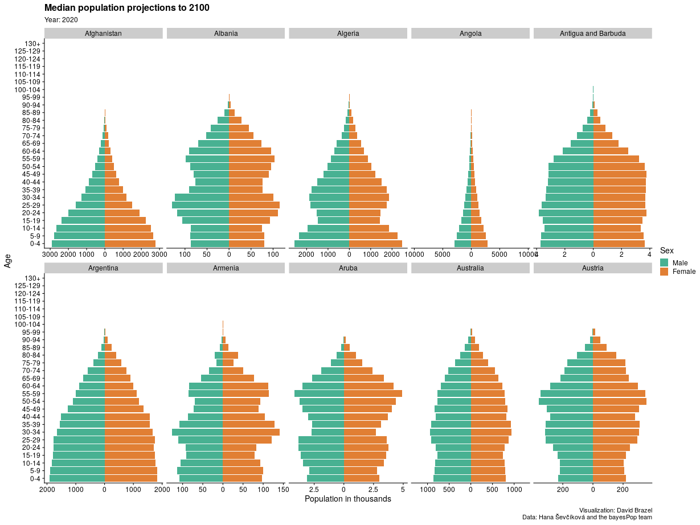
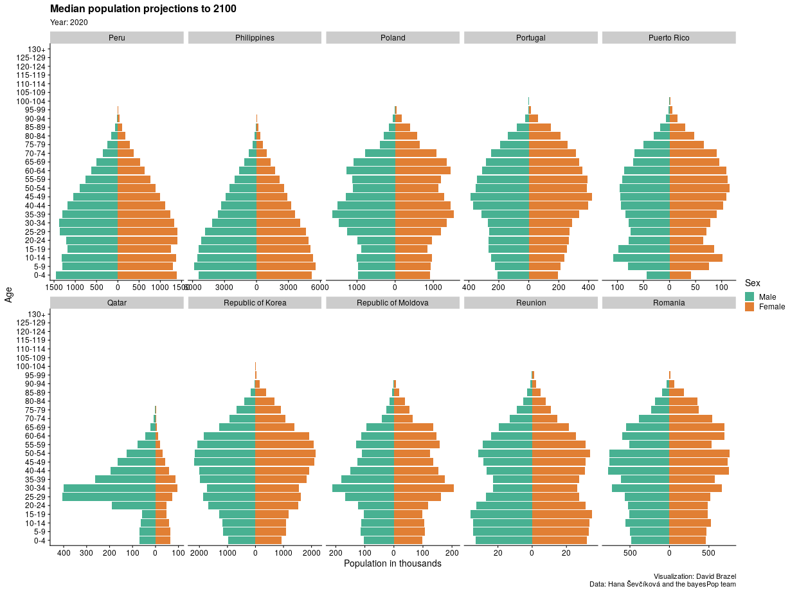

This repo contains animated population pyramids, showing projections for many countries to 2100.

In the summer of 2019, I had the privilege of attending the 2019 Applied Bayesian Statistics Summer School on Bayesian demography, taught by Adrian Raftery and Hana Ševcíková. While playing around with the probabilistic projections produced by their BayesPop software [1] using data from WPP 2019 [2], I made animated population pyramids to show the median projections for each country, by year, sex, and age, which I share here. However, the visualized projections are not the official UN population projections.

Here are some examples, the full set are in [figs/](figs/), the script to generate them is [src/animate_projections.R](src/animate_projections.R), and the projections are in [data/full_pop_sim](data/full_pop_sim).

[1] Hana Sevcikova, Adrian E. Raftery (2016). bayesPop: Probabilistic Population Projections. Journal of Statistical Software, 75(5), 1-29. doi:10.18637/jss.v075.i05

[2] United Nations Population Division (2020). wpp2019: World Population Prospects 2019. R package version 1.1-1. https://CRAN.R-project.org/package=wpp2019
